# M239

## Apache Webserver

Der Apache Webserver gehört zu den `HTTP`-Diensten mit dem grössten Bekanntheitsgrad. Die Entwicklung begann kurz nach dem "Ur-Webserver", dem CERN httpd.

Nebst der Auslieferung von Daten über `HTTP`, kann Apache auch als `(Reverse-)Proxy` eingesetzt werden. Auch kann es um Module wie `PHP`, `Python`, u.v.m. erweitert werden.

Darunter finden sich auch `mod_lua` und `mod_http2`:

### mod_lua

Dieses Modul erlaubt es dem Server Script, welche in der Programmiersprache `Lua` geschrieben wurde, einzusetzen. Darunter findet sich die Implementierung von `mapping requests` zu Daten, Generierung von dynamischen `Responses` u.v.m.

### mod_http2

Durch die Nutzung dieses Moduls kann Apache mit `HTTP/2` arbeiten. Hierunter fällt das `core engine` von `HTTP/2`.

### Weitere Webserver auf dem Markt

Apache ist zwar der bekannteste Webserver-Dienst, jedoch bei weitem nicht der einzige auf dem Markt. Unter den Konkurrenten finden sich `Nginx`, `LiteSpeed`, `Caddy` und `Tomcat`. <br>

Nichtsdestotrotz fällt der Marktanteil von `Apache` auf 30-40%, gefolgt von `Nginx` mit 20-30%

## Apache installieren

Die Installation wird auf einer Ubuntu-Maschine gemacht:

```bash
# System aktualisieren
sudo apt update && sudo apt upgrade -y

# Paket herunterladen
sudo apt install apache2
```

Nun kann getestet werden, ob die Installation funktioniert hat. Hierzu gibt es verschiedene Methoden:

Vom Server aus kann ein `curl` auf den localhost:80 gemacht werden:

```bash
curl localhost:80 | less
```

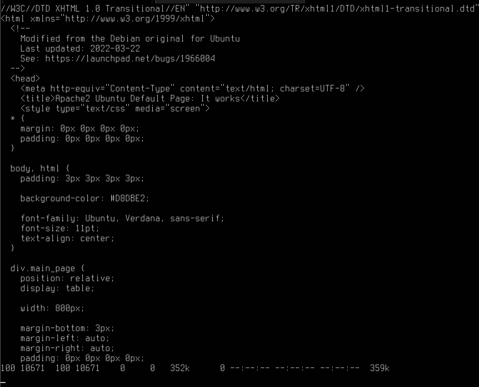

Und von den anderen Geräten im Netwerk kann auf den Server verbunden werden:

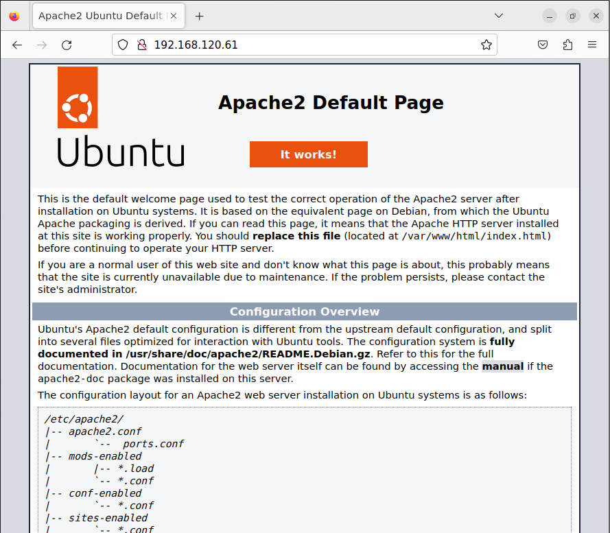


### Module aktivieren

Wir werden die Module `rewrite` und `ssl` aktivieren, da diese später benötigt werden. Die entsprechenden Befehle sind:

```bash
sudo a2enmod rewrite
sudo a2enmod ssl
sudo systemctl restart apache2
```

### Virtuelle Hosts anlegen

Um die virtuellen Hosts anzulegen, erstellen und bearbeiten wir die Dateien `/etc/apache2/sites-available/ch.mattefit.menpa.conf` und `/etc/apache2/sites-available/ch.mattefit.admin.conf`.

Der Inhalt sieht wie folgt aus:

`admin.staff.mattefit.ch`:
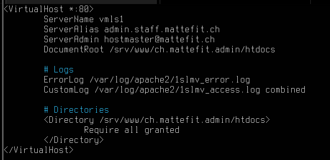

`menpa.staff.mattefit.ch`:
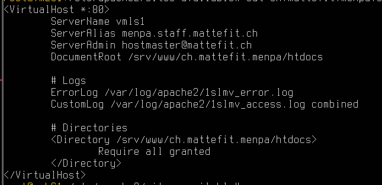

Anschliessend werden die Daten fürs `www` vom Filestash heruntergeladen und ins das Verzeichnis `/srv` geschoben. Hier müssen die Ordner nun so umbenannt werden, wie sie im vorangehend definierten File angepeilt werden. D.h. `ch.mattefit.admin` und `ch.mattefit.menpa`.

Nach dem Befehl `a2ensite ch.mattefit.admin; a2ensite ch.mattefit.menpa` sowie einem Neustart des `apache2 service` sollten die Seiten nun von den Clients aus erreichbar sein:

`admin.staff.mattefit.ch`:


`menpa.staff.mattefit.ch`:


`192.168.120.61`:
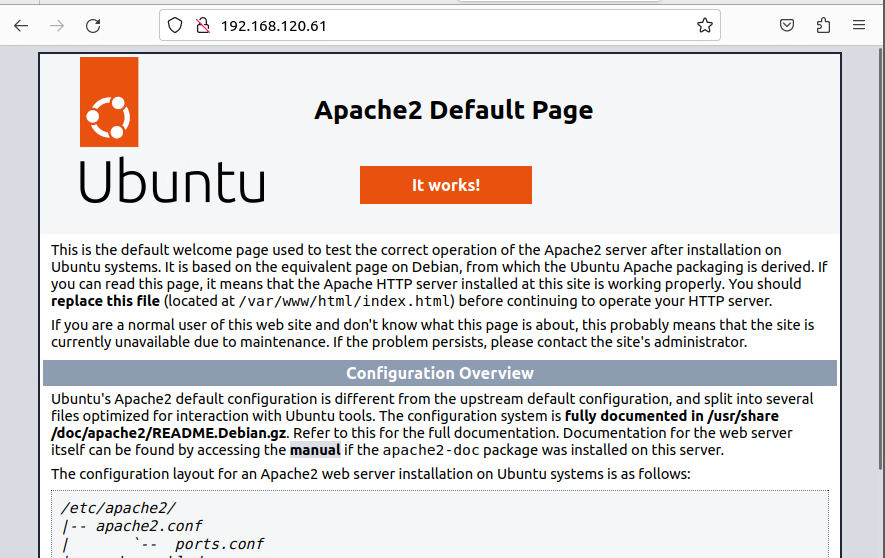

### Listing

Für die Trainerseite möchten wir ein `Listing` einrichten. Dieses dient dem Zweck, dem User alle im Verzeichnis liegenden Daten einsehen zu können.

Hierzu erstellen wir den Ordner `/srv/www/ch.mattefit.menpa/htdocs/public`, mit einem `test.txt` drin. Damit dieses nun angezeigt werden kann, benötigen wir folgende Ergänzung am `ch.mattefit.menpa.conf` File:


Nun wird nach einem `systemctl restart apache2` folgendes angezeigt, wenn man `menpa.staff.mattefit.ch/public` abruft:

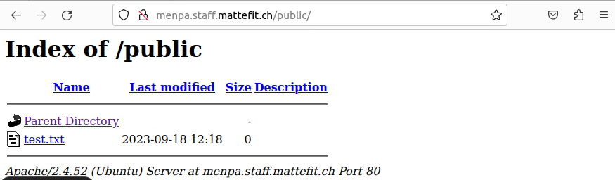


### Passwortschutz

Wir möchten den Adminbereich mit eine Passwort schützen, damit es nicht öffentlich zugänglich ist. Hier arbeiten wir mit Basic-Authentication. Es gelten Folgende Bedingungen:

1. Passwortfile unter `/srv/www/ch.mattefit.admin/.htpasswd` erstellen
2. Bereich soll "Adminbereich mattefit.ch" heissen
3. User `admin` und `sekretariat` sollen mit PW `sml12345` Zugang haben

#### Passwortfile erstellen

Wir können das Passwortfile generieren lassen. Hierzu nutzen wir den Command `cd /srv/www/ch.mattefit.admin/ && htpasswd -c .htpasswd admin && htpasswd .htpasswd sekretariat`. Damit dies dann auch eingesetzt wird, müssen wir folgende Ergänzungen im `ch.mattefit.admin.conf` machen:

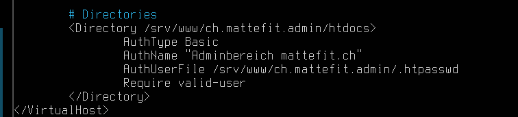

Nach einem `systemctl reload apache2` sollte es nun funktionieren:

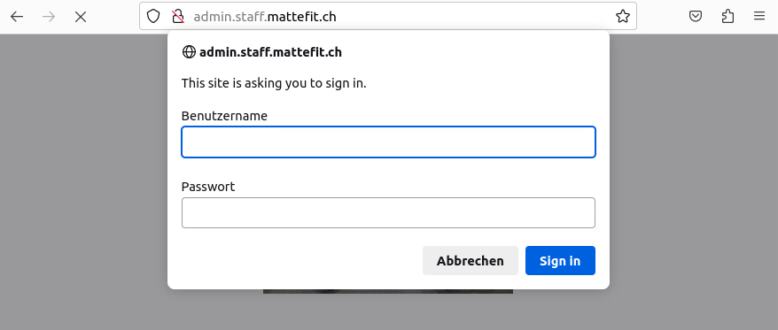

### HTTPS-Verbindung zu admin.staff.mattefit.ch

Wir möchten eine sichere Verbindung zu ``admin.staff.mattefit.ch`` herstellen können. Hierzu nutzen wir `SSL`.
Spezifisch erstellen wir lokal ein RSA-Key, mit welchem wir dann ein sogenanntes `self-signed Certificate` erstellen - hier spiele wir die Rolle eines CA (`Certificate Authority`).

Die nötigen Befehle sind:

```bash
cd /etc/ssl

# Erstellen des privaten Keys, sowie CSR (Certificate Signing Request)
sudo openssl req -new -newkey rsa:2048 -nodes -keyout ch.mattefit.admin.key -out ch.mattefit.admin.csr -sha256
```

Hier werden verschiedene Sachen abgefragt. Folgendes wurde eingegeben:

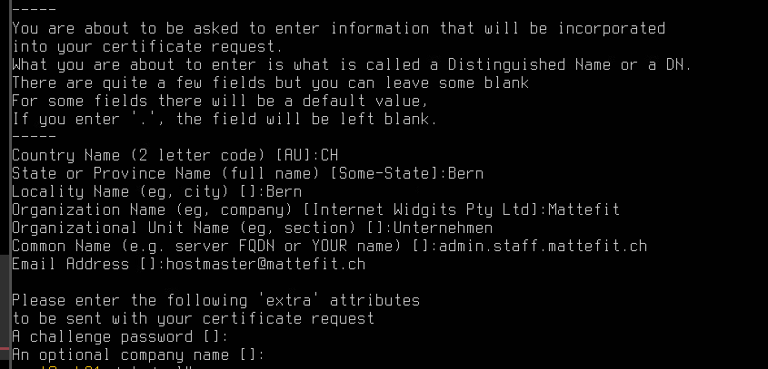

Nun kommt:

```bash
# Ausstellung des .crt Zertifikates
sudo openssl x509 -req -days 365 -in ch.mattefit.admin.csr -signkey ch.mattefit.admin.key -out ch.mattefit.admin.crt -sha256
```
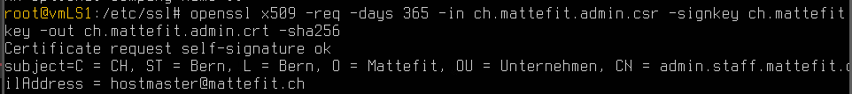

#### Apache-Einlesung des Zertifikates

Damit das Zertifikate genutzt werden kann, muss Apache wissen, wo es ist. Auch werden gewisse Konfigurationen benötigt:

```bash
cd /etc/apache2/sites-available
cp -p ch.mattefit.admin.conf ch.mattefit.admin_ssl.conf
nano ch.mattefit.admin_ssl.conf
```

Von hier muss nun beim `VirtualHost` der Port auf `*:443` geändert werden, und folgende Ergänzungen sind nötig:

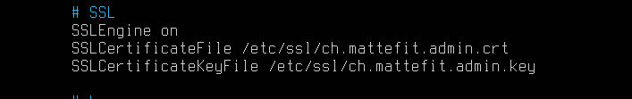

Nun ist nach einem `systemctl restart apache2` der Abruf mit `https://admin.staff.mattefit.ch` möglich - da es sich aber um ein eigens erstelltes Zertifikat handelt, kommt folgende Fehlermeldung:


Somit haben wir nun Zugriff auf `admin.staff.mattefit.ch`, mit einer sicheren Verbindung:

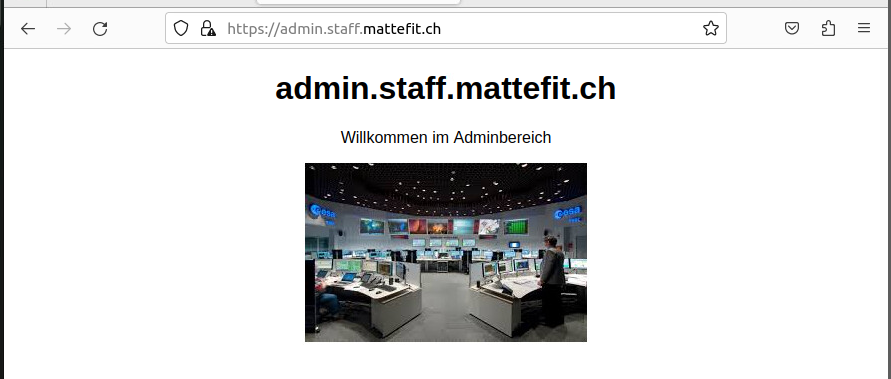
