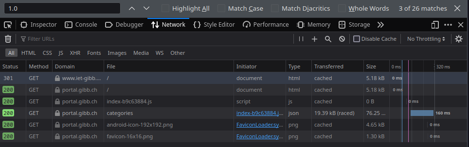

# M239

## HTTP-Protokoll

Das HTTP-Protokoll wurde erstmals im Jahre 1991 vorgestellt (Entwicklung begann 1989), und wurde initial im CERN in der Schweiz entwickelt. `HTTP`, `HTML` sowie der erste Webserver haben also alle ihren Ursprung in der Schweiz. Hier spielt Tim Berners-Lee eine wichtige Rolle als Hauptentwickler.

## HTTP/0.9

Dies war die erste Version von `HTTP`. Sie entstand im Jahre 1989. Hierunter findet sich die simple Definition des Verhaltens von Client und Server

## HTTP/1

Im Jahre 1996 wurde die Erweiterung des `HTTP/0.9` publiziert. Hier findet sich eine grosse Erweiterung des Funktionen: Die Version wurde bei `GET Calls` mitgegeben, und auch ein `Status Code` wurde jeweils mitgegeben. Dies signalisierte, ob der Call erfolgreich war, oder ob es Probleme gab.

Auch kam der `Content-Type Header` auf, welcher das übermitteln von Daten, welche nicht im `HTML`-Format waren, ermöglichte.

## HTTP/1.1

Mit dieser Version kam die erste standardisierte Verion auf. Diese wurde im frühen 1997 veröffentlich - nur wenige Monate nachdem HTML/1 publik gieng.

Mit dieser neuen Version kamen verschiedenste Verbesserungen:

- Eine Verbindung konnte wiederverwendet werden. D.h. für die Anzeige verschiedener Informationen aus einer Quelle waren keine Mehrfachverbindungen mehr nötig

- `Pipelines` wurden hinzugefügt. Dies erlaubt es, mehrere Abfragen abzuschicken, bevor eine eine Antwort zurückkam. 

- `Caching` wurde verbessert

- u.v.m.

## HTTP/2

2015 wurde die Version 2 von der IETF (Internet Engineering Task Force) publiziert. Hier wurde auf ein binäres Protokoll, anstelle des Text-Protokolls gesetzt; dies erlaubt bessere Optimierungen. Weitere Neuerungen beinhalten:

- `Multiplexed Protokoll`, welches die parallelen Abfragen über eine Verbindung ermöglichen

- Die `Headers` werden komprimiert. Da diese über mehrere Requests hinweg gleich sind, kann der `Overhead` verkleinert werden.

- Das Cache kann durch den Server beschrieben werden, namentlich `server push`

## HTTPS://

Durch die Einführung der Verschlüsselung durch SSL (Secure Sockets Layer) ermöglichte es den nicht-kommerziellen Nutzern, ihre Verbindung zu sichern. Dies weil die Kosten tief bis nichtig wurden .

Damit diese Verschlüsselung funktionieren kann, ist ein entsprechendes Zertifikat nötig - dieses signalisiert dem Browser, dass die Website vertrauenswürdig ist.

## HTTP analysieren

Hierzu machen wir einen Seitenabruf auf dem Browser (Firefox), und analysieren den mittels der inbegriffenen Netzwerkanalyse:

Wir rufen `www.iet-gibb.ch` auf - hier sehen wir alle `HTTP`-Requests (1 Zeile = 1 Request):



In der zweiten Zeile sehen wir unter File `/` - dies ist das `root-Verzeichnis`der Website. Das ist die erste Seite, welche vom Server angefordert wurde. In diesem `HTML`-File findet sich der Code, welcher die Seite darstellt. Darunter auch `CSS`-, `JavaScript`- und sonstige Dateien, welche vom `HTML` abgerufen werden.

Der `Request` von Seiten User:

```HTML
https://portal.gibb.ch/GET / HTTP/2
Host: portal.gibb.ch
User-Agent: Mozilla/5.0 (X11; Linux x86_64; rv:109.0) Gecko/20100101 Firefox/117.0
Accept: text/html,application/xhtml+xml,application/xml;q=0.9,image/avif,image/webp,*/*;q=0.8
Accept-Language: en-US,en;q=0.5
Accept-Encoding: gzip, deflate, br
Connection: keep-alive
Cookie: _ga=GA1.2.548471899.1678111013; XSRF-TOKEN=eyJpdiI6IlBjcmpoVkRKSEpnTUNwQW5FTThqV3c9PSIsInZhbHVlIjoiUVBXdXNoVUltTGp1eStXMS9qNndSUm1hR2dpVWJyS0t0MEJBbDVWelNUeFZNRVBGOHN5ME0xMWpHanNSSHdhTXQxSjJoNDR4MmJxaWJIaFZmQUFpNWFMamM5SStGMTB2YW52dExib1lJN2RzRGkyWFRIajlBc0JuYW5HaUtyTksiLCJtYWMiOiJhZTEzMDc5OTIyZjkzY2FiNDQ3YjA1ODA3MDViYjlmMjNmMDhiMDE2MDlhNjE0MzQ3NGI1M2M5ZTY0NThmYTM4IiwidGFnIjoiIn0%3D; gibb_portal_session=eyJpdiI6IjNWYk5vRHFEbTBBUXQzTk13VG1wQlE9PSIsInZhbHVlIjoiQ1NDZmlwS3JjVDlZWDM4WHIzZHFCZDdxSDQ1cW9uRlg1WGV0SHJyYzFxVWE4NHc4cUlRRWZEUEZyaVo4a2VOVjR4THdvMTJJWGNnTmhTakRqYWNodkRwODhjZ0RYOUkwZGxEREFsTStOajlvUWwreDRKQ05mcktvb09YbnVsbEMiLCJtYWMiOiJjMjU1MGU5YWQyNzVmZjYwOGQ0N2YyNTYyMGNlNzUzY2ZjN2Y4OTAwOTM3NmMwZTc4YTEyZmMyZmI5ZTRkZWQxIiwidGFnIjoiIn0%3D
Upgrade-Insecure-Requests: 1
Sec-Fetch-Dest: document
Sec-Fetch-Mode: navigate
Sec-Fetch-Site: none
Sec-Fetch-User: ?1
```

Und die entsprechende `Response`:


```HTML
HTTP/2 200 OK
server: nginx
date: Mon, 11 Sep 2023 06:16:56 GMT
content-type: text/html; charset=utf-8
last-modified: Wed, 18 Jan 2023 12:42:35 GMT
vary: Accept-Encoding
etag: W/"63c7e93b-143b"
x-frame-options: SAMEORIGIN
x-xss-protection: 1; mode=block
x-content-type-options: nosniff
content-encoding: gzip
X-Firefox-Spdy: h2
```

In Fällen wo die Übertragung unverschlüsselt geschieht, könnte sie mit einem Tool wie `WireShark` direkt abgefangen und eingesehen werden.

### Request

| Header-Feld     | Beschreibung                                                                         |
| --------------- | ------------------------------------------------------------------------------------ |
| User-Agent      | Informationen über den aanfragenden Browser                                          |
| Accept          | Der gewünschte Datentyp der Antwort                                                  |
| Accept-Encoding | Wie die Antwort komprimiert sein darf                                                |
| Accept-Language | Welche Inhaltssprachen der Browser bevorzugt, mit Priorität                          |
| Cookie          | Übermittelte Cookies                                                                 |
| Connection      | Anfrage, die Verbindung offen zu lassen, da vermutlich weitere Daten benötigt werden |

### Response

| Header-Feld      | Beschreibung                                               |
| ---------------- | ---------------------------------------------------------- |
| Server           | Welche Serversoftware diese Antwort gegeben hat            |
| Date             | Datum und Uhrzeit des Webservers                           |
| Content-Type     | Welche Art Inhalt mitgeliefert wird                        |
| Content-Length   | Länge des Inhalts in Bytes                                 |
| Connection       | Ob Server einverstanden ist, Verbindung aufrecht zu halten |
| Last-Modified    | Wann der inhalt das letzte Mal modifiziert wurde           |
| ETag             | Eindeutige Kennung des Inhalts                             |
| Content-Encoding | Wie der Inhalt auf dem Weg zum Browser komprimiert wurde   |