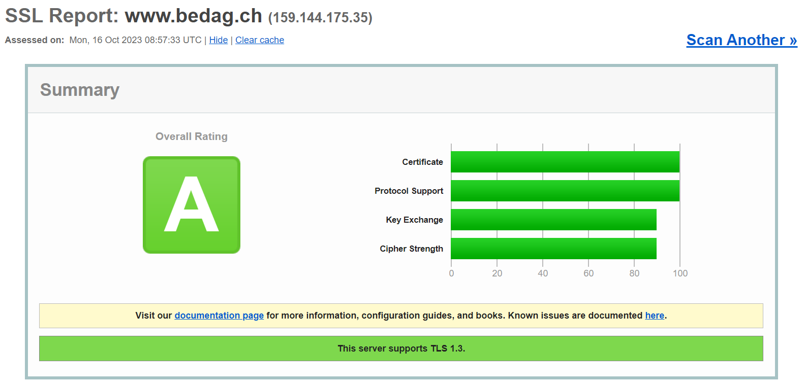

# M239

## Performance

Ein TLS-Zertifikat einzurichten ist zwar ein Schritt in die richtige Richtung, jedoch kann das System falsch konfiguriert sein. Das heisst, dass evtl veraltete Protokollversionen akzeptiert werden, welche entsprechende Sicherheitslücken mit sich bringen.

### Online SSL-Test

Ein Online-Test ist mit [SSLLabs](https://www.ssllabs.com/ssltest/) möglich - hier der Test von der Seite meines Lehrbetriebes:



### Offline SSL-Test

Da es viele Fälle gibt, in welchen eine Website online nicht erreichbar ist, ist die Nutzung des zuvor genannten Tools keine Option. Im Rahmen dieses Moduls nutzen wir das Script `testssl.sh`, welches auf Github verfügbar ist.

#### Script Ausführen

Als erstes benötigen wir `git`, damit wir das Script von Github herunterladen können. Hierzu gehen wir auf die `vmLP1`, und geben `sudo apt install git`.

Sobald das gemacht ist, können wir das Script mit `git clone https://github.com/drwetter/testssl.sh.git`

Als erstes müssen wir nun das Script mit `chmod +x` ausführbar machen. Danach wird es mit `./testsstl.sh https://admin.staff.mattefit.ch` ausgeführt. Mit dem Flag `--html` kann ein entsprechendes [Output-File](./testssl.html) erstellt werden.

### Apache-Konfiguration

#### TLS- und SSL-Version

Wir möchten die TLS- und SSL-Versionen, welche erlaubt sind, anpassen. Momentan sind ältere Versionen erlaubt, was eine Sicherheitslücke darstellt.

Damit wir das erzielen können, müssen wir folgendes machen:

Wir erstellen die Datei `/etc/apache2/conf-available/mattefit_ssl.conf`, welcher wir folgenden Inhalt geben:

```conf
# TLS Version anpassen
SSLProtocol -ALL +TLSv1.2
```
Hiermit spezifizieren wir die erlaubten TLS-Versionen.

- SSLProtocol: Diese Direktive setzt die vom Server erlaubten Protokolle fest
- -ALL: Hiermit werden initial alle Protokolle deaktiviert
- +TLSv1.2: Dies erlaubt die TLS-Version 1.2


Damit diese Konfiguration genutzt wird, gibt man nun `sudo a2enconf mattefit_ssl.conf`.

#### HSTS

HSTS (HTTP Strict Transport Security) ist ein Sicherheitsmechanismus, welcher vor "protocol downgrade attacks" und "cookie hijacking" hilft.

Dies ist im Apache2 als Modul verfügbar. Um es zu aktivieren, muss man `sudo a2enmod headers` in die Konsole eingeben.

Um es anzuwenden, muss folgender Eintrag dem Virtualhost beigefügt werden, in meinem Fall der Datei `/etc/apache2/sites-available/ch.mattefit.admin_ssl.conf`:

```conf
# HSTS aktivieren
Header always set Strict-Transport-Security "max-age=31536000; includeSubDomains; preload"
```

- Header always set Strict-Transport-Security: Hier wird HSTS aktiviert
- max-age: Der Header darf ein maximales alter von 1 Jahr haben
- includeSubdomains: Subdomänen sind miteinbegriffen
- preload: Die Seite wird in der Browser-HSTS-Liste preloaded

Sobald die nötigen Änderungen vorgenommen wurde, kann der Server mit `sudo systemctl reload apache2` neugestartet werden.


#### SAN

SAN (Subject Alternative Names) ist ein Apache-SSL-Zertifikat, welches generiert oder eingeholt werden muss:

1) Schlüssel erstellen mit `openssl req -new -newkey rsa:2048 -nodes -keyout mattefit_admin.key -out mattefit_admin.csr`
2) Zertifikat installieren, in dem dass man es in das Directory `` legt
3) Apache-Konfiguration `/etc/apache2/sites-available/ch.mattefit.admin_ssl.conf` anpassen. Dort, wo die SSL-Keys festgelegt sind, wird neu auf die SAN-Keys gezeigt.
```conf
# Pfade zu SSL-Zertifikaten mit SAN-Einträgen
SSLCertificateFile /etc/ssl/ch.mattefit.admin_san.crt
SSLCertificateKeyFile /etc/ssl/ch.mattefit.admin_san.key
```

Anschliessend werden die Änderungen mit `sudo systemctl reload apache2` gespeichert

#### Ciphers reduzieren
