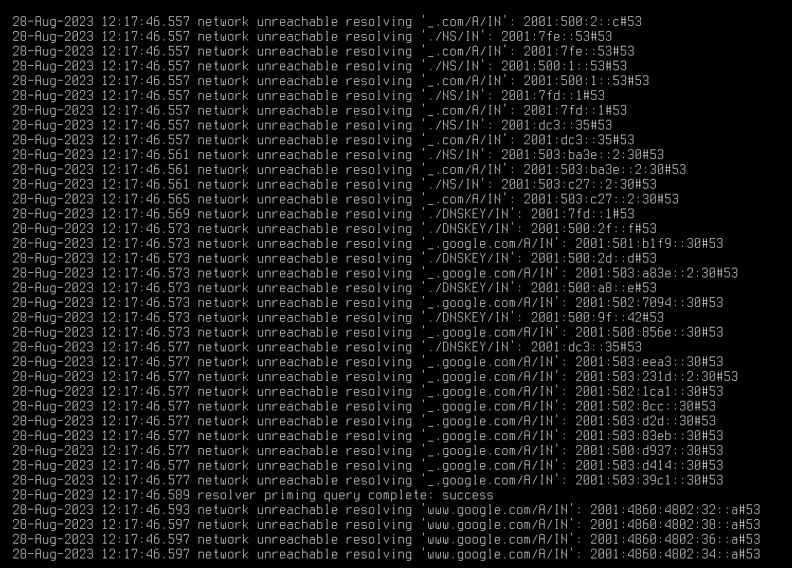

# M239

> Gemäss Herr Jäggi: Keine Kompilierung nötig, kann direkt heruntergeladen werden

## `BIND9` 

`BIND9` steht für "Berkeley Internet Name Domain version 9" und ist ein weit verbreiteter Open-Source-DNS-Server.

`BIND9` ist ein leistungsstarker DNS-Server, der in der Lage ist, DNS-Anfragen zu beantworten, DNS-Zonen zu verwalten und die Übersetzung von Domainnamen in IP-Adressen zu ermöglichen. Es ist sowohl auf der Ebene des Authoritative Servers (für die Verwaltung von DNS-Zonen) als auch auf der Ebene des Resolver-Servers (für das Beantworten von DNS-Anfragen von Clients) nutzbar.

### Installation

Die Installation wird auf der vmLS1, einer Ubuntu-Maschine gemacht:

1. Apt updaten, upgraden
```bash
sudo apt update -y && sudo apt upgrade -y
```

2. BIND + Dependencies herunterladen

```bash
sudo apt install bind9 bind9utils bind9-doc -y
```

3. Sicherstellen, dass der Dienst läuft

```bash
sudo systemctl status bind9
```

### Konfiguration

Die Hauptkonfiguration von `BIND9` läuft über das `named.conf file`.

Um eine Test-Konfiguration anzulegen, folgen wir der Anleitung aus AB203:

1. Leere Konfigurationsdatei anlegen

```bash
sudo touch /etc/bind/named.conf
```

2. `BIND9` starten, laufend Logs anzeigen

```bash
sudo named -g
```

3. In zweiter Session das `BIND9` testen

```bash
dig www.google.ch @127.0.0.1
```

Screenshots vom `sudo named -g`:


