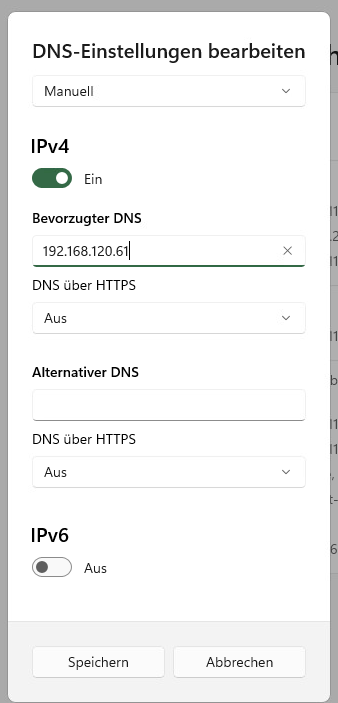
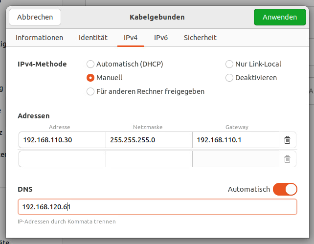
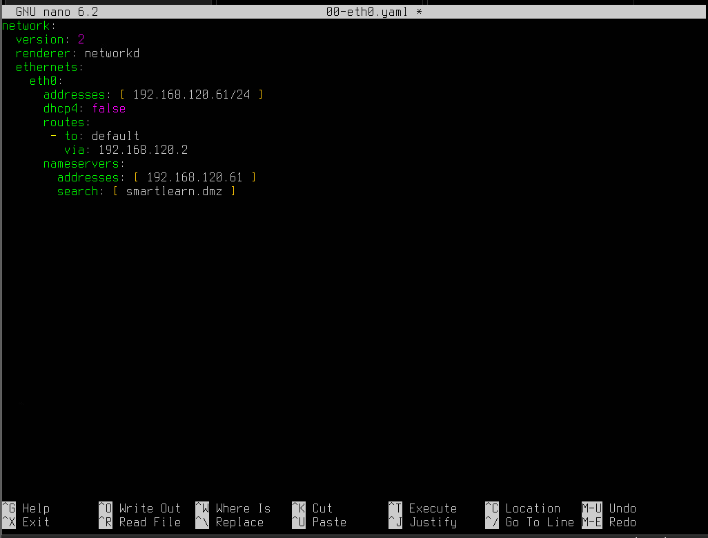

# M239

> Gemäss AB204

## BIND9 - Konfiguration

- Zunächst werden die nötigen Konfigurationsdateien angelegt:

```bash
sudo touch named.conf
sudo touch named.conf.local
sudo touch named.conf.options
```

- Anschliessend wird folgender Inhalt in `named.conf` eingefügt:

```bash
include "/etc/bind/named.conf.options";
include "/etc/bind/named.conf.local";

options {

};
```

- Foldender Inhalt ins `named.conf.options`:

```bash
options {
    
    // IPV4
    listen-on port 53 {
        any;
    };

    // IPV6
    listen-on-v6 {
        none;
    };

    // DNS-Anfragen an Quad9 weiterleiten
    forwarders {
        1.1.1.1;
        9.9.9.9;
    };

    // Anfragen von uerberall moeglich
    allow-query {
        any;
    };

    // Rekusrive Anfragen fuer Clients
    allow-recursion {
        any;
    };
};
```

- Server neustarten

```bash
sudo reboot now
```

- `BIND9` starten, mit Logs

```bash
sudo named -g
```


- `dig` erneut versuchen

```bash
dig www.google.ch @127.0.0.1
```


### Konfigurationen vmLS1, vmWP1, vmLP1

Die Konfigurationen von vmWP1 und vmLP1 werden übers GUI gemacht - vmLS1 wird übers CLI bearbeitet:

vmWP1: 

vmLP1: 

vmLS1: 

Die Änderungen in vmLS1 müssen noch mit `sudo netplan apply` aktiviert werden.

## Fehlersuche

Fehler in der Konfiguraton würden im Bind log erscheinen. Dieser findet sich unter `/var/log/syslog`.

## Kommentare

Um Kommentare in einem `.yaml` File zu schreiben, benötigen diese ein `//` davor.

## Einrücken

Die Einrückung ist bei der Arbeit mit `.yaml` Files sehr ausschlaggebend, und oft auch der Grund für viele Fehlkonfigurationen.

Wichtig ist hier, dass man durchgehend entweder mit Tabulator oder mit Leerschlägen einrückt, und diese Methoden nicht durchmischt anwendet.

## Liste der Root-Server aktualisieren

Um diese Liste zu aktualisieren, kann mal als `su` folgenden Befehl ausführen:

```bash
dig @a.root-servers.net | grep -E -v ';|^$' sort > /etc/bind/db.root
```

## DNS-Zonen einrichten

### Netzwerkübersicht


