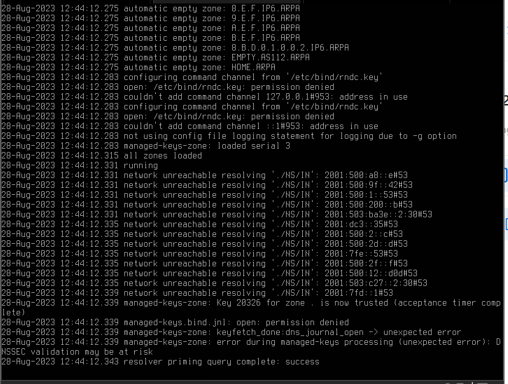
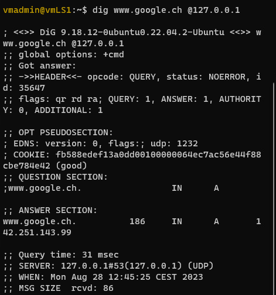

# M239

> Gemäss AB204

## BIND9 - Konfiguration

- Zunächst werden die nötigen Konfigurationsdateien angelegt:

```bash
sudo touch named.conf
sudo touch named.conf.local
sudo touch named.conf.options
```

- Anschliessend wird folgender Inhalt in `named.conf` eingefügt:

```bash
include "/etc/bind/named.conf.options";
include "/etc/bind/named.conf.local";

options {

};
```

- Foldender Inhalt ins `named.conf.options`:

```bash
options {
    
    // IPV4
    listen-on port 53 {
        any;
    };

    // IPV6
    listen-on-v6 {
        none;
    };

    // DNS-Anfragen an Quad9 weiterleiten
    forwarders {
        1.1.1.1;
        9.9.9.9;
    };

    // Anfragen von uerberall moeglich
    allow-query {
        any;
    };

    // Rekusrive Anfragen fuer Clients
    allow-recursion {
        any;
    };
};
```

- Server neustarten

```bash
sudo reboot now
```

- `BIND9` starten, mit Logs

```bash
sudo named -g
```



- `dig` erneut versuchen

```bash
dig www.google.ch @127.0.0.1
```



### Konfigurationen vmLS1, vmWP1, vmLP1

Die Konfigurationen von vmWP1 und vmLP1 werden übers GUI gemacht:

