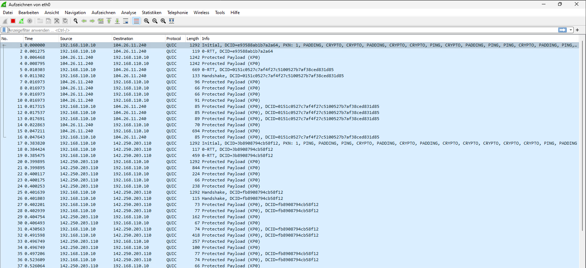
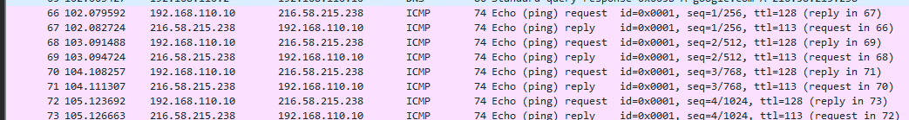
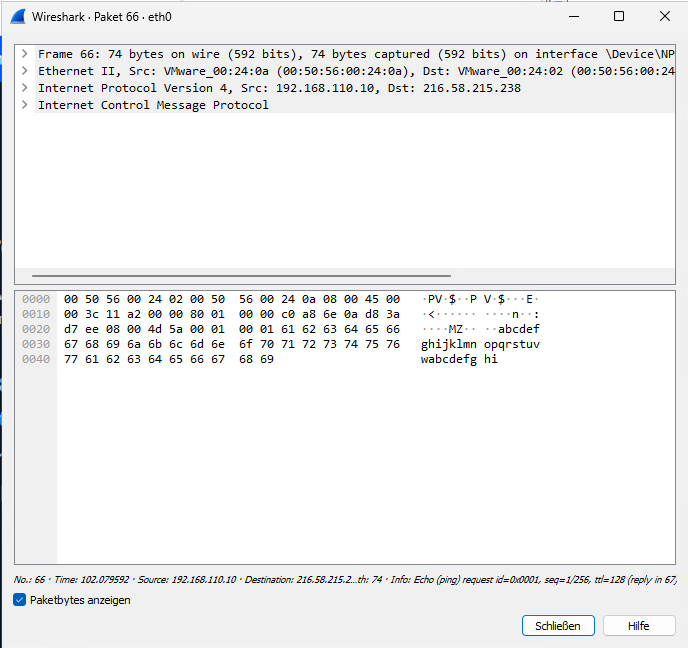
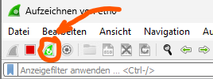
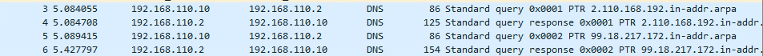
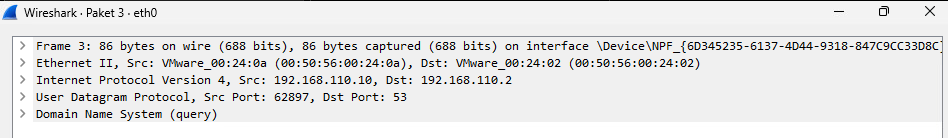
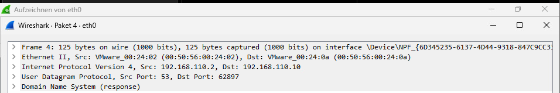

# M239

## WireShark

Wireshark ist eine Open-Source-Software für die Netzwerkanalyse. Mit Wireshark kann der Datenverkehr in ausgewählten/verfügbaren (Computer-)Netzwerken aufgezeichnet, analysiert und überwacht werden. Um dies zu tun, erlaubt Wireshark Pakete und Nachrichten im Netzwerk zu erfassen, zu filtern sowie auch detailliert zu durchsuchen.<br>
Durch diese Funktionen können Probleme im Netzwerk diagnostiziert, allfällige Sicherheitsbedrohungen erkannt und auch genereller Netzverkehr eingesehen und analysiert werden. Dies kann u.a. bei unerwartet tiefer Leistung helfen, um allfällige Übeltäter zu erkennen.

Wireshark selbst unterstützt eine Breite an unterschiedlichen Protokollen: TCP, UDP, HTTP/HTTPS, DNS, DHCP, SNMP, FTP, SMTP, u.v.m.

All das wird in einem leicht verständlichen User Interface ermöglicht, wo auch Zugriff auf eine anfangs komplizierte, aber schnell erlernbare Suchfunktion gegeben wird. Diese erlaubt es, nach spezifischen Protokollen, Sender/Empfänger, und vielen anderen Sachen zu filtern.

### Installation - Ubuntu

1. Apt updaten, upgraden

```bash
sudo apt update && sudo apt upgrade
```

2. Wireshark herunterladen

```bash
sudo apt install
```

3. User der Wireshark-Gruppe zuteilen

```bash
sudo usermod -aG wireshark smladmin
```

4. Aus- und wieder einloggen / Reboot

```bash
sudo reboot now
```

### Installation - Windows

1. Entsprechende Version herunterladen

<https://www.wireshark.org/download.html>

2. Installations-Wizard befolgen

### Outputs

#### Abruf Wireshark-Download-Page



#### `ping google.com`



### Pakete

Pakete, welche von Wireshark erkannt werden, können jew. angeschaut werden, um mehr Informationen zu erhalten. Dies kann durch ein Doppelklick auf ein gewünschtes Paket erreicht werden. Hier Paket vom oben gezeigten `ping` command:



In den Paketen selbst finden sich je nach Protokoll unterschiedliche Informationen. So kann bei einem Web-Abruf die gesuchte Website rausgelesen werden, oder bei einem `ping` die Ziel-IP (hier: 216.58.215.238).

### Reverse Lookup

In diesem Kapitel wird ein Reverse Lookup gemacht. Dies gemäss der Anleitung aus AB202:

1. Lokales DNS Cache leeren

```powershell
ipconfig /flushdns
```

2. Wireshark-Aufzeichnung verwerfen



3. Reverse-DNS-Anfrage

```powershell
nslookup 172.217.18.99
```

4. Aufzeichnung stoppen


*Pakete 1 und 2 stammen vom Host-Gerät*


*DNS-Anfrage*


*DNS-Antwort*